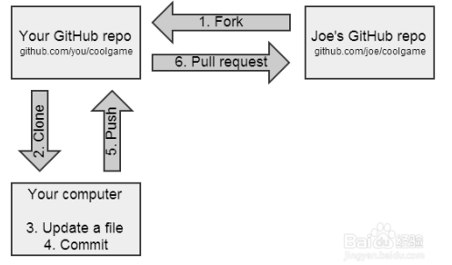
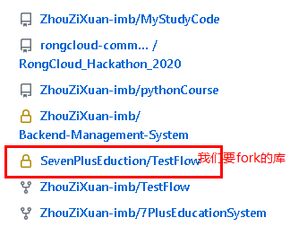
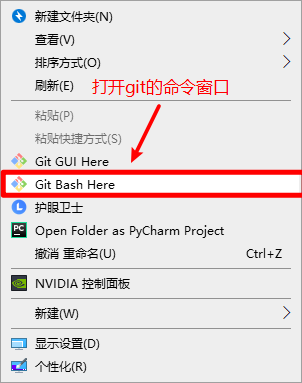

#  Github中库的fork分支与合并分支

### 如何fork库？



1. 第一步，我们打开我们要fork的库

- 
  
2. 打开库之后右上角有一个fork按钮

- 
  
3. 点击fork之后，会弹出一个弹框

- 
  
4. 现在在我们的github中已经有了这样的一个分支库，现在我们就可以把这个分支库clone到自己的本地 (其实就是clone到自己的电脑上)

   `注意：这里clone的库一定是我们fork下来的库，不可以直接clone我们要fork的库，不然我们fork库就失去了意义`

   - 

   - 

   - 

5. clone完成后，我们的桌面上就会有一个和github中fork下来的库的名字一样的文件夹

   - 现在我们第一步的fork和clone都已经完成了，我们现在就可以先添加一个新的txt文档先试试水，新建一个文件之后，我们把这个文件提交到我们的github库中，打开命令行，第一步：`git add .`, 第二步：`git commit -m '这里写我们提交的内容是做什么的'` 第三步：`git push`  三步代码结束之后，我们就可以在github中看到我们新增的txt文件了
   - 
   - 注意！`我们Pullrequests只是试试水而已，我们真正提交代码的时候 Pull requests 之前还要做一些事情，我们接着往下看`

### 如何创建本地分支

   - 首先我们要了解为什么要创建分支
     - 我们创建分支的作用是用来把都写在自己本地的分支上，写完代码检测完没有问题之后，我们这个时候就可以把本地分支中的代码合并到我们的fork下来的远端分支上，再从远端分支上把代码全都Pull requests到上游分支（上游分支就是我们代码最终要提交到的主仓库）

   - 使用   `git branch 分支的名字`  来创建一个本地分支
   - 在我们创建分支之前，我们首先要 查看一下我们的远端仓库的地址

**重点**：此时可以在控制台输入 `git remote -v` 命令查看当前远端仓库的地址，输出如下：

```git
origin  git@github.com:xxx/github-flow.git (fetch)
origin  git@github.com:xxx/github-flow.git (push)
```

可以看出该地址的远端（origin）为刚刚 fork 到自己的托管空间下项目地址。

接下来我们可以设置一个名字为 upstream 的上游地址，也就是我们项目主仓库的地址
在命令行执行：

```git
git remote add upstream 主仓库的地址
```

添加一个别名为upstream(上游)的地址，指向之前 fork 的原项目仓库地址。
再次执行 `git remote -v` 控制台输出如下：

```git
origin  git@github.com:xxx/github-flow.git (fetch)
origin  git@github.com:xxx/github-flow.git (push)
upstream    git@github.com:fe/github-flow.git (fetch)
upstream    git@github.com:fe/github-flow.git (push)
```

设置上游地址的目的是当我们通过 pull request 的形式提到主仓库之后，本地仓库需要同步主仓库的代码，并及时更新到 origin（远端）仓库，保证自己托管空间下本地和远端仓库的代码都是最新的。

之后运行下面几条命令，就可以保持本地仓库与上游（upstream）仓库同步了

```text
git fetch upstream   // 这句代码的意思是下载远程端的所有改动到本地 不会自动合并到当前
git merge upstream/要合并的分支名   // 这句代码的意思是 将分支合并到当前 （这里的合并是把上游主仓库的代码合并到我们的本地，合并到本地之后我们才开始写代码）
```

### 如何合并

- 首先我们要知道我们合并的是什么，我们是要把自己的本地分支合并到我们fork下来的远端分支上，再从远端分支Pull requests到主仓库
- 那我们怎么合并代码呢？ 请看下面
  - 我们在本地自己的分支中写完了代码，然后我们把代码 `git add .` 全部提交 然后 `git commit -m '提交的代码的简介'` 把本地写的代码全部提交到暂存区，提交到暂存区之后   我们现在的分支是自己的本地分支，我们现在需要把分支切换到远端的fork下来的库的分支  `git checkout 要切换的分支的名字`  这个时候我们就切换完成了，切换完成之后 我们需要把刚刚本地分支中的代码合并到远端的分支中 `git merge 本地分支的名字`  合并完成后我们fork下来的本地分支上就有了我们的代码，但是远端分支还没有，所以我们现在就要把fork下来的本地分支中的代码全部 `git push`  到远端 这个时候我们就可以在github远端库中看到我们写好的代码了 ，接下来就是把远端中的代码 Pull requests给主仓库了
- 我们为什么要Pull requests到主仓库呢？Pull requests又是什么呢？
  -  Pull requests 其实就是我们给主仓库发起一个请求，告诉主仓库，我们的某一个完整的功能或者所有的代码全都写完了，请把我的代码合并到你的库中（他的仓库就是主仓库，因为我们fork他的仓库的分支，所以我们写代码需要把代码提交到这个主仓库中请求合并，合并完成后在主仓库中就有了我们的代码）

- `注意：我们Pull requsts之后，我们不要点其他的东西了，因为我们Pull requests请求过去之后，主仓库的人需要检查代码有没有问题，如果没有问题的话他才会合并代码，如果代码有问题，他就会拒绝合并，所以如果我们Pull requests之后没有等主仓库的人同意就直接擅自把代码接收，虽然可以把代码删掉，但是还是会留下痕迹，这样会让你的寿命减少（挨打）所以我们Pull requests之后就不要乱动了哦 ` 
