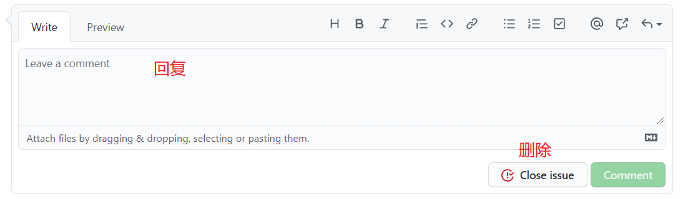

# 柒加教育官网-项目规范

### 1.docs 文件夹

```bash
存放文档和笔记
```

### 2.public 文件夹

```
1.public目录下的文件并不会被Webpack处理：它们会直接被复制到最终的打包目录（默认是dist/static）
2.public建议放一些外部第三方库
```

### 3.src 文件夹

#### 1.assets 文件夹

```bash
1.存放项目共用的代码以外的资源，如：图片、图标、视频 等；
2.存放页面的css文件、js文件

图片处理,在webpack.base.conf.js 文件里配置
 {
    test:/\.(jpg|png|svg|gif)/,  //test 属性代表可以匹配的图片类型
    use:[{
      loader:'url-loader',
      options:{
        limit:8129, //小于limit限制的图片将转为base64嵌入引用位置
        fallback:'file-loader',//大于limit限制的将转交给指定的loader处理
        outputPath:'imgs/'//options会直接传给fallback指定的loader
      }
    }]
  }

file-loader解释
   webpack通过file-loader处理资源文件，它会将rules规则命中的资源文件按照配置的信息（路径，名称等）输出到指定目录，并返回其资源定位地址（输出路径，用于生产环境的publicPath路径），默认的输出名是以原文件内容计算的MD5 Hash命名的。

解释：Base64是网络上最常见的用于传输8Bit字节码的编码方式之一
  优点：
base64就是一串字符串码来表示的图片，在加载页面或者js的时候就一并加载过来，减少图片引用时单独的一次http请求。了解web端性能优化的同学都知道，http请求每次建立都会占用一定的时间，对于小图请求来说，可能http建立请求的时间比图片下载本身还长。所以对小图进行base64转码是优化http请求，保证页面加速渲染的一种手段。
  缺点：
base64缺点就是之前提到的，他会增加图片本身的大小，对小图片来说，增加大小导致js的请求增长完全能弥补多一个http请求的建立的时长，这种取舍是划算的。可是对于大图来说，这样的取舍是不划算的。
```

#### 2.components 文件夹

```
功能组件，公用的组件，复用(重复使用多次)的组件 放在 components 目录
```

#### 3.routers/index.js 文件

```bash
配置路由
```

#### 4.views 文件夹

```bash
页面级组件，放在 views 目录里面
```

#### 5.App.vue

```bash
App.vue是我们的主组件，所有页面都是在App.vue下进行切换的。其实你也可以理解为所有的路由也是App.vue的子组件。
```

#### 6.main.js

```bash
main.js是项目的入口文件，项目中所有的页面都会加载main.js,所以main.js,主要有三个作用：
1.实例化Vue。
2.放置项目中经常会用到的插件和CSS样式。例如： 网络请求插件:axios和vue-resource、图片懒加载插件：vue-lazyload
3.存储全局变量。例如（用于的基本信息）
```

### 4.@和../

```js
//  @代表src文件夹
//  ./代表当前目录下的同级目录
//  两者都是相对路径
// 可以在webpack.base.conf.js 文件里配置
  resolve: {
    extensions: ['.js', '.vue', '.json'],
    alias: {
      'vue$': 'vue/dist/vue.esm.js',
      '@': resolve('src'),
    }
  }
```

### 5.命名规范

#### 1.文件夹命名规范（组件）

```bash
推荐使用：
	1.单词小写
	2.多个单词使用驼峰命名首单词也要大写  例如：searchButton
	3.使用语义化英语单词，尽可能不要使用拼音
	4.vue后缀的文件首单词字母大写 例如：ArticleCon
```

#### 2.类名命名规范

```
推荐使用：
	1.单词小写
	2.多个单词使用-连接 例如：search-Button
	3.子孙元素第一个单词和父级第一个单词相同    例如 <div class="content"><div class="content-item"></div></div>
```

#### 3.变量方法名命名

```
推荐使用：
	1.单词小写
	2.多个单词使用驼峰命名  例如：searchButton
	3.使用语义化英语单词，尽可能不要使用拼音
```

### 6.项目创建注意点

- assets 文件夹当不同页面具有公共图片和相同 css 要避免资源浪费
- components 文件夹不同页面的相同组件可以只创建一次避免资源浪费
- router/index.js 路由配置需要每个人单独配置，要注意格式
- main 引入第三方库要注意避免重复配置

### 7.git 提交项目

1.提交项目前先在命令行窗口输入 git pull (git pull: 更新本地 git 仓库）然后再提交代码

2.提交项目要注明提交内容，修改内容也要标注,如果删除内容要提前和其他人员沟通

3.当进行修改或者添加可以进入https://gitmoji.carloscuesta.me/

- 
- 打开 viscode 复制到提交文本框,复制内容后面填写提交内容


- 在 github 中会出现下面图标提示

 

#### 图标提交规范

可以参考下面也可以参考https://gitmoji.carloscuesta.me/

`commit提交规范：图标 xxxxx`

```js
🎉: 开始一个项目

🍻: 酒后写代码

🎨: 改善代码的结构/格式

✨: 引入新功能

🔥: 删除代码或文件

🐛: 修正错误

🩹: 简单修复非关键问题

📝: 添加或更新文档

🚀: 部署东西

🚧: 工作正在进行中

💡: 在源代码中添加或更新注释

🍱: 添加或更新assets

🚚: 移动或重命名资源（例如：文件，路径，路由）

🔧: 添加或更新配置文件

```

### 8.后台请求长篇文字无样式

```bash
从后台请求文本的时候，文本是没有任何样式的，要想和文本添加样式要提取和后端沟通
```

### 9.lssues 使用步骤

##### 1.第一步


##### 2.第二步


##### 3.第三步


##### 4.删除和回复

1.第一步选择对应的 lssues


2.第二步



##### 提交规范

1. 提交问题的时候要讲明问题，最好可以通过图片进行标注
2. 项目出现问题要及时发送 lssues
3. 及时留意 lssues，及时解决关于本人的问题
4. 问题解决完成后要及时消除 lessue
